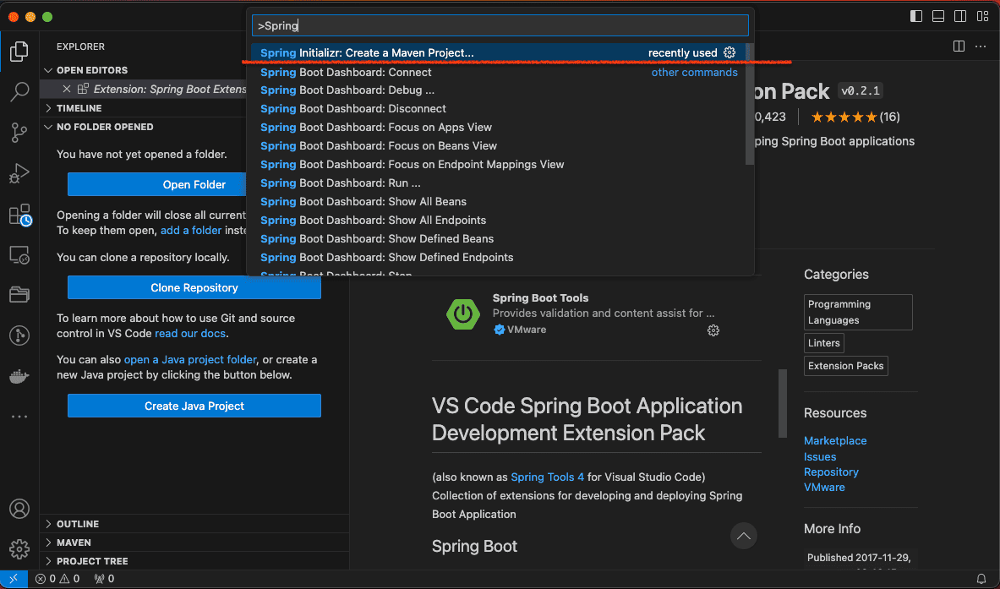
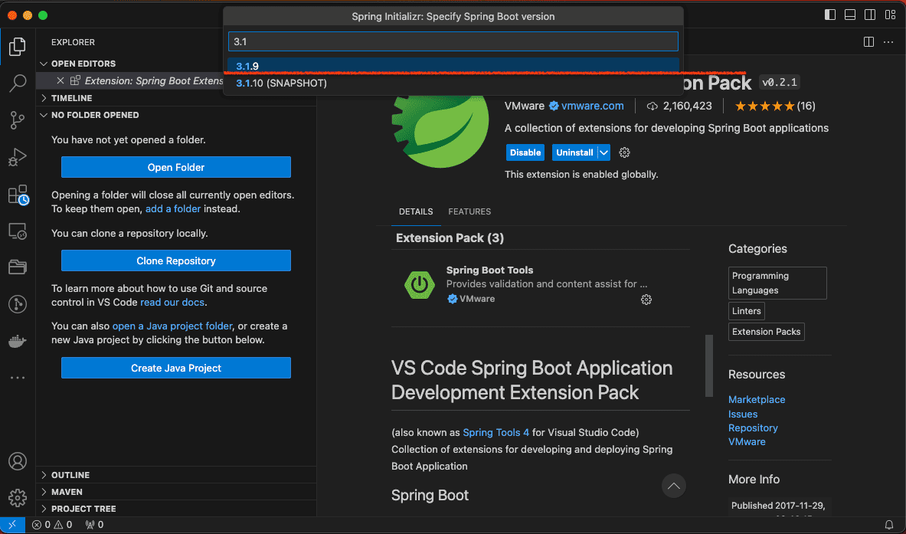
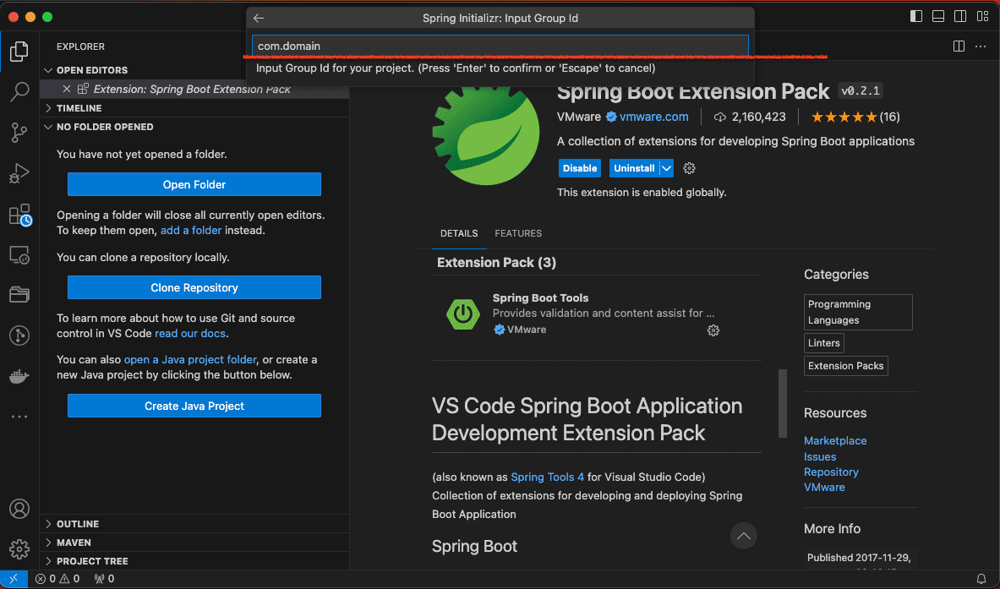
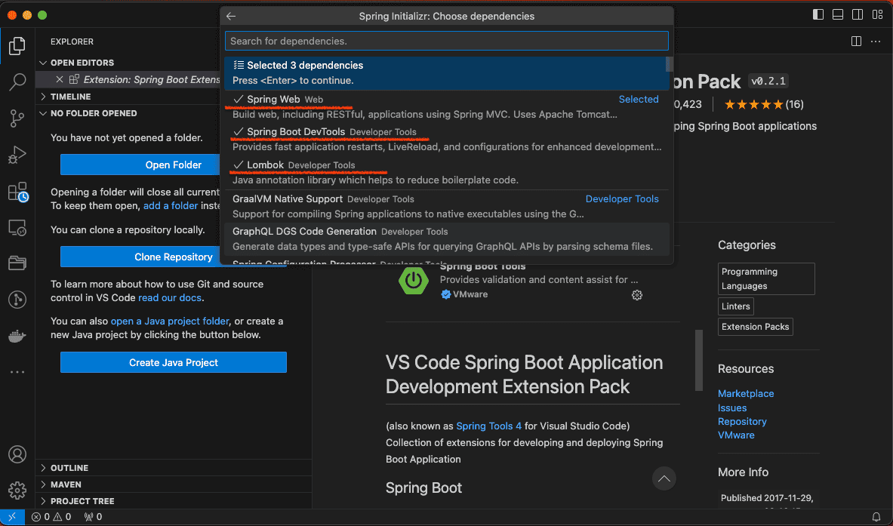
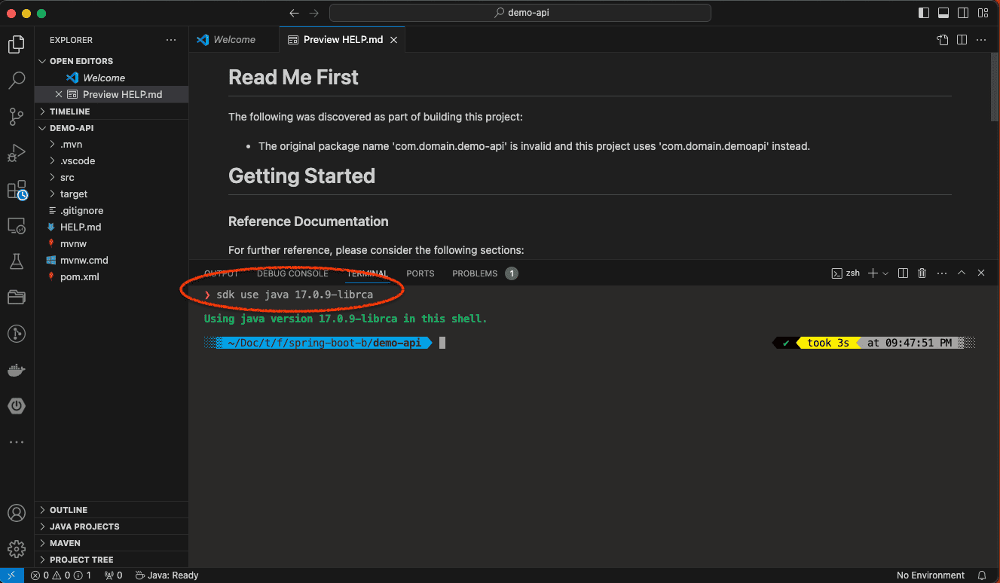

    

# SPRING-BOOT BEGINNER WELCOME

### &#x1F530; About :

    [Visual Studio Code]

        Version: 1.87.0 (Universal)
        Commit: 019f4d1419fbc8219a181fab7892ebccf7ee29a2
        Date: 2024-02-27T23:42:56.944Z
        Electron: 27.3.2
        ElectronBuildId: 26836302
        Chromium: 118.0.5993.159
        Node.js: 18.17.1
        V8: 11.8.172.18-electron.0
        OS: Darwin arm64 22.4.0

### &#x1F530; Begin project

- Create Project (summary) :
-  - VSC Open Command Palate ( up + command + shift + p)
-  - keyword "> spring", select `Spring Initializr: Create a Maven Project`
-  - Specify Spring Boot version : 3.1.9
-  - Specify project language : Java
-  - package name : com.domain
-  - Artifact ID : demo-api
-  - Specify package type : Jar
-  - Java Version : 17
-  - Choose dependencies : 
        - -> Spring Web
        - -> Spring Boot DevTools
        - -> Lombok ( function : reduces boilerplate code )

 ### &#x1F530; Run project

    ❯ cd demo-api

    ❯ sdk use java 17.0.9-librca

        Using java version 17.0.9-librca in this shell.

    ❯ mvn spring-boot:run

        [INFO] Scanning for projects...
        [INFO] 
        [INFO] ------------------------< com.domain:demo-api >-------------------------
        [INFO] Building demo-api 0.0.1-SNAPSHOT
        [INFO] --------------------------------[ jar ]---------------------------------
        [INFO] 
        [INFO] >>> spring-boot-maven-plugin:3.1.9:run (default-cli) > test-compile @ demo-api >>>
        [INFO] 
        [INFO] --- maven-resources-plugin:3.3.1:resources (default-resources) @ demo-api ---
        [INFO] Copying 1 resource from src/main/resources to target/classes
        [INFO] Copying 0 resource from src/main/resources to target/classes
        [INFO] 
        [INFO] --- maven-compiler-plugin:3.11.0:compile (default-compile) @ demo-api ---
        [INFO] Nothing to compile - all classes are up to date
        [INFO] 
        [INFO] --- maven-resources-plugin:3.3.1:testResources (default-testResources) @ demo-api ---
        [INFO] skip non existing resourceDirectory /Users/.../spring-boot-3.1.9-java-17-beginner-first-create-maven-project/demo-api/src/test/resources
        [INFO] 
        [INFO] --- maven-compiler-plugin:3.11.0:testCompile (default-testCompile) @ demo-api ---
        [INFO] Changes detected - recompiling the module! :input tree
        [INFO] Compiling 1 source file with javac [debug release 17] to target/test-classes
        [INFO] 
        [INFO] <<< spring-boot-maven-plugin:3.1.9:run (default-cli) < test-compile @ demo-api <<<
        [INFO] 
        [INFO] 
        [INFO] --- spring-boot-maven-plugin:3.1.9:run (default-cli) @ demo-api ---
        [INFO] Attaching agents: []

        .   ____          _            __ _ _
        /\\ / ___'_ __ _ _(_)_ __  __ _ \ \ \ \
        ( ( )\___ | '_ | '_| | '_ \/ _` | \ \ \ \
        \\/  ___)| |_)| | | | | || (_| |  ) ) ) )
        '  |____| .__|_| |_|_| |_\__, | / / / /
        =========|_|==============|___/=/_/_/_/
        :: Spring Boot ::                (v3.1.9)

        2024-03-13T09:06:15.608+07:00  INFO 64617 --- [  restartedMain] com.domain.demoapi.DemoApiApplication    : Starting DemoApiApplication using Java 17.0.9 with PID 64617 (/Users/.../spring-boot-3.1.9-java-17-beginner-first-create-maven-project/demo-api/target/classes started by powercommerce in /Users/.../spring-boot-3.1.9-java-17-beginner-first-create-maven-project/demo-api)
        2024-03-13T09:06:15.610+07:00  INFO 64617 --- [  restartedMain] com.domain.demoapi.DemoApiApplication    : No active profile set, falling back to 1 default profile: "default"
        2024-03-13T09:06:15.634+07:00  INFO 64617 --- [  restartedMain] .e.DevToolsPropertyDefaultsPostProcessor : Devtools property defaults active! Set 'spring.devtools.add-properties' to 'false' to disable
        2024-03-13T09:06:15.634+07:00  INFO 64617 --- [  restartedMain] .e.DevToolsPropertyDefaultsPostProcessor : For additional web related logging consider setting the 'logging.level.web' property to 'DEBUG'
        2024-03-13T09:06:15.982+07:00  INFO 64617 --- [  restartedMain] o.s.b.w.embedded.tomcat.TomcatWebServer  : Tomcat initialized with port(s): 8080 (http)
        2024-03-13T09:06:15.991+07:00  INFO 64617 --- [  restartedMain] o.apache.catalina.core.StandardService   : Starting service [Tomcat]
        2024-03-13T09:06:15.991+07:00  INFO 64617 --- [  restartedMain] o.apache.catalina.core.StandardEngine    : Starting Servlet engine: [Apache Tomcat/10.1.19]
        2024-03-13T09:06:16.016+07:00  INFO 64617 --- [  restartedMain] o.a.c.c.C.[Tomcat].[localhost].[/]       : Initializing Spring embedded WebApplicationContext
        2024-03-13T09:06:16.017+07:00  INFO 64617 --- [  restartedMain] w.s.c.ServletWebServerApplicationContext : Root WebApplicationContext: initialization completed in 381 ms
        2024-03-13T09:06:16.179+07:00  INFO 64617 --- [  restartedMain] o.s.b.d.a.OptionalLiveReloadServer       : LiveReload server is running on port 35729
        2024-03-13T09:06:16.197+07:00  INFO 64617 --- [  restartedMain] o.s.b.w.embedded.tomcat.TomcatWebServer  : Tomcat started on port(s): 8080 (http) with context path ''
        2024-03-13T09:06:16.203+07:00  INFO 64617 --- [  restartedMain] com.domain.demoapi.DemoApiApplication    : Started DemoApiApplication in 0.744 seconds (process running for 0.948)

Open Browser :

    

---

## &#x1FA90; explanation with screen image capture

    

    

    

    

    

    

    

    

    

    

    

    

    

    

---

    

